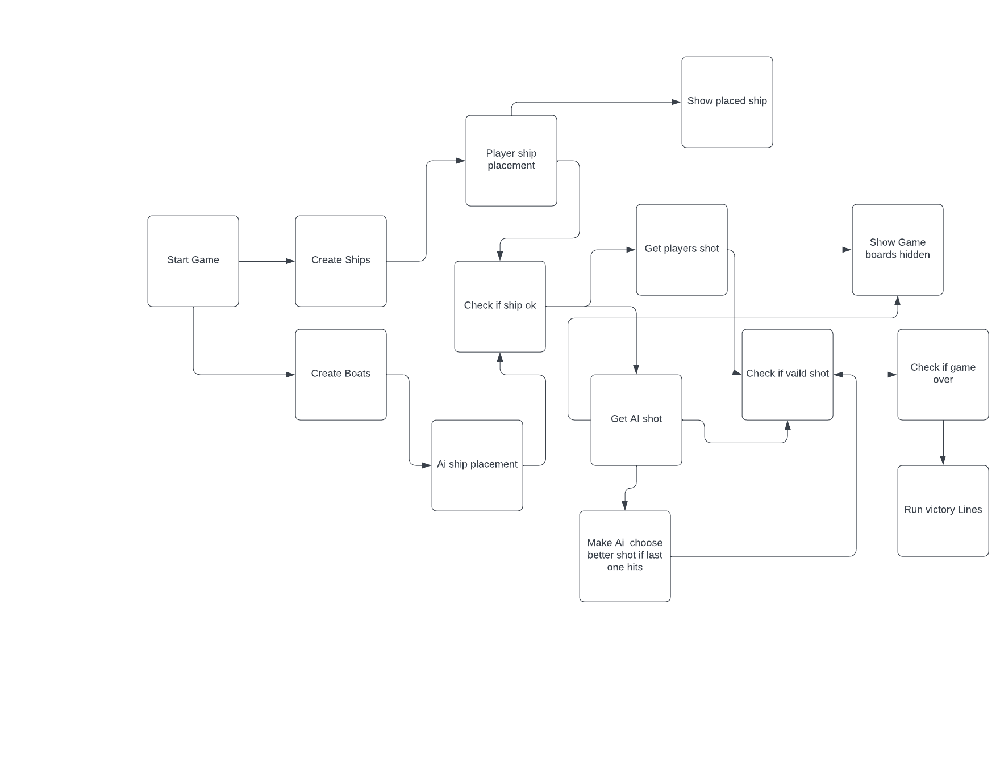

# BAD BATTLESHIP GAME Left the name since im not happy

[Live link](https://very-bad-battleship.herokuapp.com/)

Bad Battleship Game is python terminal game which i ran in code institute mock terminal in heroku.

User have to first set all battleships on the board.Each battleship is diffrent size and direction for your board and computers.

## how to play

Game start of with you placing the ships.

Once placed you are shown your board and you can start shooting the enemy by writing a number from 00 to 99.

Missed shots are X and hit ships are O.

Once all ships sank for either you or computer the game is over.

## UX

## Strategy

### Vision

The Bad Battleship game is a old classic game brought to life whit limited python skills inside a terminal.

Before i started to create Battleship game i went through 6 battleship tutorials. From that i learned i had no idea how to build class based so went whit function based.
To save gitpod time which is 50 hours i tried to use vs code whit python installed which did not end well. In the end got it working after many erros which made no sense.

After i got the code editor working i wrote down all the functions i need:

1. create ship
2. place ship
3. check if ship in grid
4. create computer random ship
5. place ship in random direction
6. show player grid
7. hide computer grid
8. get player shot
9. check if shot ok
10. get computer shot
11. add tactics to computer so he shoots smarter
12. check if game over
13. main function to store and run functions

After main flow is decided i choose to use the random library since it gets me a random number.

### External users goal

- The application user wants to play a logic game

### My Goal

- The Battleships game is played on grids on which each player's fleet of battleships are marked. The locations of the fleets are concealed from the other player. Players call shots at the other player's ships, and the objective of the game is to destroy the opposing player's fleet.
- The application provides a working battleships game for a single user to play against the computer .e.g.
- To Test my skills

## Features

### Home Page

The home page is the only page on the application. The terminal design was created and given to me by Code Institue.
No Style was added since did know which library to look for.

Few exsisting features:

- You can choose your battleship placements
- Computer ships are generated randomly
- ships are hidden
- can only play against computer
- Accepts user input
- input validation error
  - if number 2 big or not a number
  - can not enter same number on either ship placing or shooting

### Future features

- turn to class based
- add second player
- show scores
- show if ship is sunk and if you hit it
- Create better UI

## Technology Used in design

Throughout the planning, design, testing, and deployment of the website, I have used several technologies.

- [Python](https://www.python.org/):
  - Python is the core programming language used to write all of the code in this application to make it fully functional.
- [GitHub](https://github.com/dashboard):
  - Used to store code for the project after being pushed.
- [Git](https://git-scm.com/):
  - Used for version control by utilizing the GitPod terminal to commit to Git and push to GitHub.
- [GitPod](https://gitpod.io/workspaces):
  - Used as the development environment.
- [Heroku](https://heroku.com/):
  - Used to deploy my application.
- [Lucid Chart](https://lucid.app/users/login#/login):
  - Used to create my flow chart of the story.
- [Pep8](http://pep8online.com/):
  - Used to check my code against Pep8 requirements.

## Data Model

Project has 13 function.

- def create_ships() , which takes 2 arguments. First being ship position and second a list of battleships. It has 1 for that calls def manual_ship_placement_ship() for each ship in the list of battleships.
- def manual_ship_placement_ship() , which takes 2 arguments. First being battleships and second ship position. It has a while loop untill the battleship passes the def check_ok() then it breaks and returns value to def create_ships().\
- def check_ok() this function contains a large for loop that contains many if and elif for checking if ship is inside the grid and if it is in a single straight.
- def create_boats() is similar to create_ships() ,but takes randrange from imported random to have a random starting tile and a random direction. After that it connects to def check_boat().
- def check_boat() which takes 4 arguments boat length, staring tile, direction and ship position. Whit that it uses if and for to add the remaining tiles for each AI battleship. Connest to def check_ok() to see if it passes.
- def show_board_c() shows the player ships when adding ships manually.
- def show_board() takes 4 arguments for hit, miss, ships_sunk, and a default player=True. This shows the main playing field is hidden from both players.
- def get_shot_comp() takes 2 arguments for shots allready fired and suggested shot.
- def get_shot() takes only 1 argument. Takes your input and checks if it is valid or not then stores value in shot1.
- def calc_tactics() takes 4 arguments for current shot, last tactis, shot fired and shots that hit. Calculates next shot based on if the shot hit 2 times in a row and is the ship sunk. If no more hits in a row it will go back to random untill it finds new ship.
- def check_shot() takes 5 arguments for current shot, ships, previous hits, previous misses and sunken ships. Return if it is hit, miss or sunken a ship. For AI it also return missed value which is used to trigger calc_tactics().
- def check_if_empty_2() takes 1 arguemnt for Battleships. Checks whether all ships are sunken or not.
- def startgame() has no arguments but holds all the variables and triggers the functions.

## Testing

Most of the testing was done manualy by playing the game. Game ran and did not break for my limited understanding.
Libarary was changed since i found out VS CODE function named "Go to definition" ,which i used to find out the necessary method names.

Truly no guidance on the tools needed made the project a lot more difficult ,which resulted in this error.

'I can easly see what game it is.'

'Game is working and your ships can be seen.'

'Game ending works alltough guide crude.'

## Fixing Failed Project

Most Project 3 feedbacks were fixed

Game was changed little for fear that adding one might break the other.

## Panic Time

Had to waste 3 days to get python to work on computer

17 days of nightmarish bugs and relearning and then repeating while being all alone whit no help.

2 many errors every last function was like hell other then the if,elif and else

No code breaking bugs remain

### Validator testing

PEP8  validation results when first ran:

- contained lots of trailing whitespace that did not show up on visualstudio
- do not use bare 'except' added typeerror
- missing whitespace after ',' fixed by deleting lines
- Variable name "ch" doesn't conform to snake_case naming style fixed by changing name
- Consider using enumerate instead of iterating with range and len
- Unused variable 'missed1' if i deleted it code did not work.
- No exception type(s) specified
- ms-toolsai.jupyter extension is not synced, but not added in .gitpod.yml <-- no idea why this is here.

Left 3 diffrent pep8 suggestions inside the code since i had no idea how to change those long lines of codes.

- Left [variable missed1] inside code since function check_shot() returns a missed shot value. Is mainly used for AI to calculate a better shot next turn.
- Left [ms-toolsai.jupyter extension is not synced, but not added in .gitpod.yml] inside it is not part of my code.
- Left [Consider using enumerate instead of iterating with range and len] since i could not reduce the code to enumerate form.

## Deployment

This project static was stored on github and deployed on heroku whit [Code Institute Python Essentials Template](https://github.com/Code-Institute-Org/python-essentials-template).

1. Login or Sign Up to [GitHub](https://github.com/login "Link to GitHub login page")
2. Create a new repository.

- Give the repository a name.
- Under Repository template pick the [Code Institute Python Essentials Template](https://github.com/Code-Institute-Org/python-essentials-template).
- Click create repository
- Use GIT ADD.
- GIT COMMIT -m "Comments"
- GIT PUSH
- To commit the code and push to Github

Heroku section.

- Create a new heroku app
- set the var PORT value 8000
- set the buildbacks to python and nodejs
- link heroku app to the repository
- click on deploy

## Credits

- Youtube for training videos on how to make projects
- My own childhood where i played the game a lot
- lots of slackoverflow(was not very usefull) reading
- gitpod projects to see how python classes work(could not find a basic class one)
- especially a single youtube videos
- Self taught whit no help from others. Makes me wonder where my tuition fee went.
